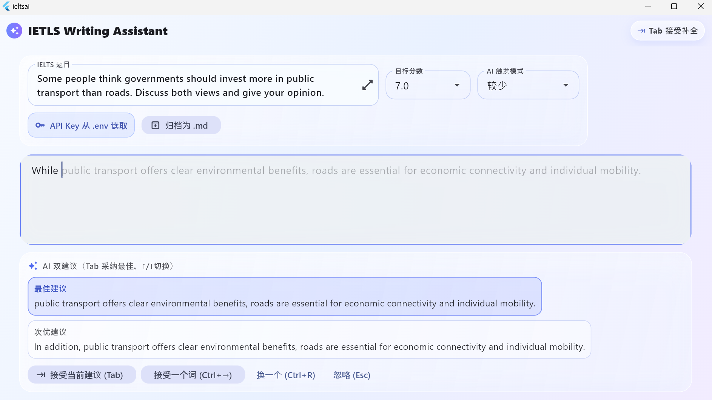
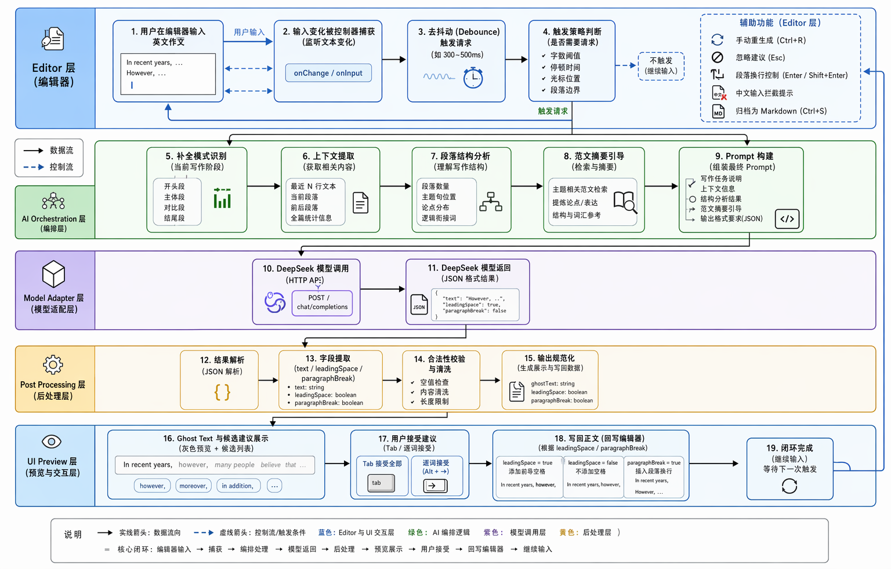

# IETLS AI

IETLS AI 是一个面向 IELTS Writing Task 2 的 Flutter 写作辅助工具，核心交互模仿 VS Code 的自动补全体验：AI 根据上下文生成下一段/下一句/续写词组建议，用户可以直接接受、逐词接受或忽略。
  
  

## 产品特性

- 编辑器内 Ghost Text 预览，支持 Tab 一键接受补全。
- `Ctrl + →` 逐词接受，`Esc` 忽略建议，`Ctrl + R` 手动重新生成。
- 题目、目标分数、光标上下文都会进入提示词。
- 自动识别当前句段与段落角色，支持下一句和下一段补全。
- 引入 `assets/exemplars/` 中的范文作为结构先验，帮助模型向更稳定的段落结构靠拢。
- 生成结果采用 JSON 约束，显式控制 `text`、`leadingSpace` 和 `paragraphBreak`，减少空格和断句错误。
- 输入区限制为英文 ASCII，避免中文混入作文正文。
- 支持将当前题目和正文归档为 `.md` 文件。

## 当前界面

- 顶部 Logo 来自 [images/logo.png](images/logo.png)
- 主编辑区采用浅色玻璃拟态风格
- 右侧建议条展示候选补全文本与切换状态

## 核心流程

```text
用户输入 / 光标变化
  -> Debouncer
  -> TriggerPolicy
  -> CompletionModeDetector
  -> ContextExtractor
  -> ParagraphFrameworkAnalyzer
  -> ExemplarGuide
  -> PromptBuilder
  -> DeepSeekAdapter
  -> PostProcessor
  -> GhostTextEditor / SuggestionBar
  -> 用户接受补全写回编辑器
```

## 架构分层

```text
lib/
  main.dart
  app/
    ielts_ai_app.dart
  config/
    env_config.dart
  editor/
    document_snapshot.dart
    essay_editor_controller.dart
    suggestion_text_editing_controller.dart
  ai/
    ai_assist_engine.dart
    ai_assist_preference.dart
    completion_mode_detector.dart
    context_extractor.dart
    debouncer.dart
    exemplar_guide.dart
    paragraph_framework_analyzer.dart
    post_processor.dart
    prompt_builder.dart
    trigger_policy.dart
    model/
      model_api_adapter.dart
      deepseek_adapter.dart
    models/
      ai_request.dart
  ui/
    pages/
      essay_editor_page.dart
    widgets/
      ghost_text_editor.dart
      suggestion_bar.dart
      glass_panel.dart
```

## 模块职责

- **EssayEditorController**：管理正文输入、选区与快照生成。
- **AiAssistEngine**：协调自动触发、手动触发、流式补全和取消。
- **TriggerPolicy + Debouncer**：控制何时请求 AI，避免频繁打扰。
- **CompletionModeDetector**：判断当前适合续写词、句子还是段落。
- **ContextExtractor**：提取题目、分数、上下文、当前段落和句子。
- **ParagraphFrameworkAnalyzer**：根据已有内容推断段落角色与主题。
- **ExemplarGuide**：读取范文目录，生成结构提示摘要。
- **PromptBuilder**：把所有约束和上下文拼成模型提示词。
- **DeepSeekAdapter**：调用模型接口并流式返回结果。
- **PostProcessor**：解析 JSON 输出并规范插入格式。
- **GhostTextEditor + SuggestionBar**：负责补全预览和候选交互。

## 使用方式

```bash
flutter pub get
flutter run -d windows
```

## 环境变量

项目通过根目录 `.env` 读取 DeepSeek API Key：

```env
DEEPSEEK_API_KEY=your_api_key_here
```

未配置时，AI 请求会被拦截并提示先配置 `.env`。

## 范文目录

范文放在 [assets/exemplars/](assets/exemplars/) 下，启动后会被汇总为结构提示，作为写作段落组织的参考。

## 归档功能

点击界面中的 `归档为 .md` 后，当前题目和正文会保存到本地应用文档目录下的 `ieltsai_archives` 文件夹。

## 备注

- 当前实现以补全体验为中心，重点优化了段落结构、空格控制和单词级接受。
- 若替换模型服务，只需要实现 [lib/ai/model/model_api_adapter.dart](lib/ai/model/model_api_adapter.dart) 定义的接口。
